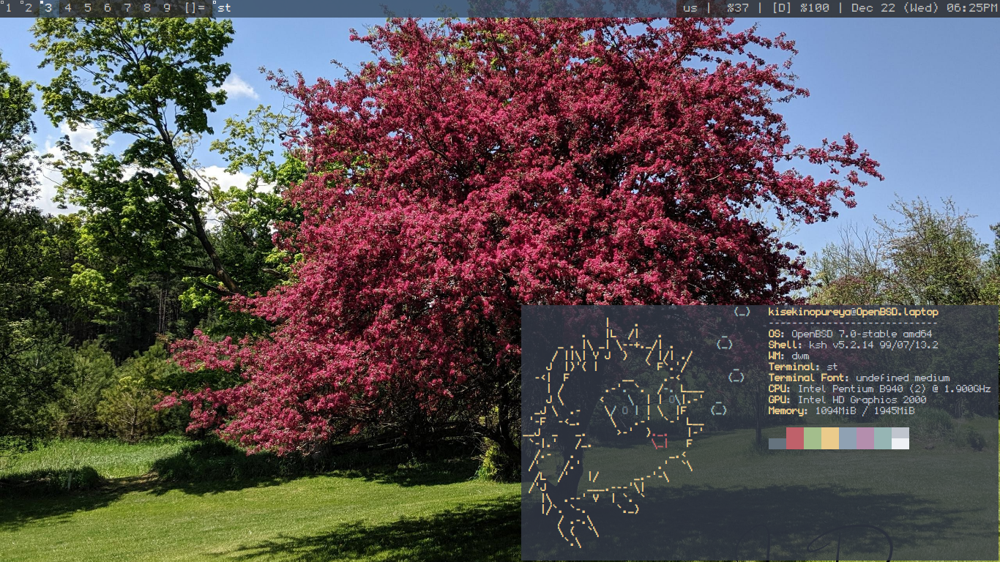

# My Dotfiles for OpenBSD

- Scripts are in ~/.local/bin
- Default Font: [undefined-medium](https://github.com/andirueckel/undefined-medium)

- My Builds[^1]:
	- dmenu (dynamic menu)
	- dwm (window manager)
	- dwmblocks (statusbar)
	- pinentry-dmenu (pinentry)
	- slock (lockscreen)
	- st (terminal emulator)
	- surf (web browser)

- Defaults:
	- doas (root helper)
	- dunst (notification daemon)
	- mpd/ncmpcpp (music)
	- mpv (video player)
	- neomutt (email client)
	- OpenBSD ksh (shell)
	- openbsd-backgrounds (wallpapers)
	- ranger (file manager)
	- scrot (screen capture)
	- search.disroot.org (search engine)
	- sndio[^2] (audio backend)
	- sxiv (image viewer)
	- vis (text editor)
	- xautolock (lock screen on inactivity) 
	- xcompmgr (compositor)
	- zathura (pdf viewer)

- To install my suckless program builds, run `~/.local/src/build all`[^3]
	- Patches and configs are in `~/.local/src/patches` `~/.local/src/configs`

## TODO:
- [ ] Add detail about scripts
- [ ] Add manual for dwm shortcuts

[^1]: Remove OpenBSD patches and variable on linux
[^2]: Check Hyperbola GNU/Linux's [sndio packages](https://www.hyperbola.info/packages/?q=sndio) to get sndio working on linux distributions
[^3]: Add `--nohelper` if not using my dwm build

